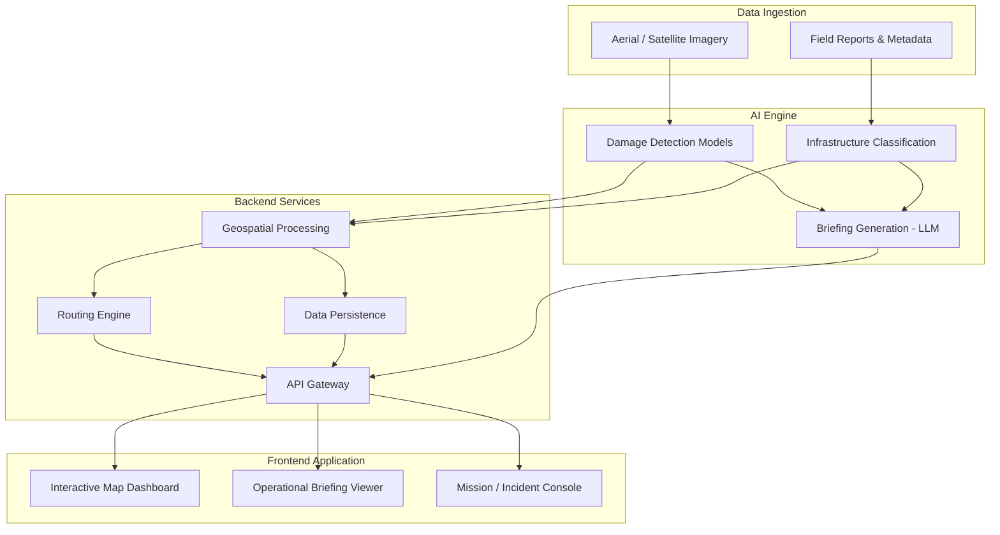

<div align="center">

# 🛰️ SentinelAI

### AI-Powered Disaster Intelligence Platform

*Turning aerial imagery into actionable intelligence for emergency responders.*

[](LICENSE)
[](PROJECT_ROADMAP.md)
[](CONTRIBUTING.md)
[](CODE_OF_CONDUCT.md)

[Overview](#project-description) •
[Features](#key-features) •
[Architecture](#system-architecture) •
[Tech Stack](#technology-stack) •
[Roadmap](#development-roadmap) •
[Contributing](#contributing)

</div>

---

## Project Description

**SentinelAI** is an open-source platform that converts raw aerial and satellite imagery captured during and after a disaster into structured, actionable intelligence for emergency responders, incident commanders, and humanitarian coordination teams.

When a disaster strikes — a hurricane, earthquake, flood, or wildfire — responders are flooded with imagery but starved of *insight*. Manually reviewing thousands of drone and satellite frames to understand where damage is concentrated, which roads are impassable, and which structures need urgent attention costs precious hours that victims do not have.

SentinelAI closes that gap. It ingests aerial imagery, applies computer vision and geospatial analysis to detect and classify damage, overlays the results on interactive maps, computes viable rescue and access routes around hazards, and uses generative AI to produce concise operational briefings that a response team can act on immediately.

The project is built and maintained in the open, following the same engineering rigor expected of production-grade infrastructure: typed APIs, reproducible environments, documented architecture, and a contribution process designed for sustained, collaborative development.

## Why SentinelAI?

Disaster response is a race against time, and the imagery pipeline available to most response teams today is not built for speed:

- **Situational awareness is fragmented.** Imagery, damage reports, and field updates typically live in disconnected tools, delaying the "single source of truth" a command center needs.
- **Damage assessment is still manual.** Analysts visually triage imagery frame-by-frame, a process that does not scale to the volume produced by modern drones and satellites.
- **Routing tools ignore disaster context.** Conventional navigation systems assume a road network is intact — a dangerous assumption immediately after a disaster.
- **Briefings take too long to produce.** Turning raw observations into a structured briefing for decision-makers is a manual writing exercise performed under extreme time pressure.

SentinelAI is designed to directly address each of these gaps with a single, cohesive platform rather than a patchwork of point solutions.

## Key Features

- **Automated Damage Assessment** — Computer vision models classify structural and infrastructure damage severity directly from aerial imagery.
- **Interactive Disaster Mapping** — Visualize affected regions, damage overlays, and points of interest on a responsive, GIS-backed map interface.
- **Infrastructure Impact Detection** — Identify impacted roads, bridges, utilities, and critical facilities within the affected area.
- **AI-Assisted Rescue Routing** — Calculate viable access and evacuation routes that account for detected hazards and blocked infrastructure.
- **Generative Operational Briefings** — Produce concise, decision-ready situation reports generated from detected findings, tailored for incident command use.
- **Extensible Data Pipeline** — Ingest imagery from multiple sources (drones, satellites, aerial survey partners) through a common processing pipeline.

## System Architecture

SentinelAI is organized as a set of loosely coupled services connected through a shared data and API layer.



**Design principles:**

1. **Separation of concerns** — imagery processing, geospatial computation, routing, and presentation are independently deployable services.
2. **API-first** — the frontend and any third-party integrations consume the same versioned backend API.
3. **Model-agnostic AI layer** — detection and generation models are swappable behind a stable internal interface, so improved models can be adopted without downstream rewrites.
4. **Cloud-portable** — the platform is containerized end-to-end and avoids hard dependencies on a single cloud provider.

Detailed architecture documentation lives in [`docs/architecture/`](docs/architecture/system-overview.md).

## Technology Stack

| Layer | Technology |
|---|---|
| **Frontend** | Next.js 15 (App Router), React 19, TypeScript, Tailwind CSS v4, shadcn/ui, TanStack Query, Zustand |
| **Backend** | Python 3.12, FastAPI, Pydantic v2, Uvicorn |
| **AI** | PyTorch, geospatial CV models, LLM-based briefing generation |
| **Database** | PostgreSQL with PostGIS for geospatial data |
| **Maps** | MapLibre GL JS, OpenStreetMap tiles, GeoJSON overlays |
| **Deployment** | Docker, Docker Compose, GitHub Actions CI/CD |

> The Database, Maps, and AI rows describe the intended architecture for later phases (see [`PROJECT_ROADMAP.md`](PROJECT_ROADMAP.md)); Frontend and Backend are implemented as of Sprint 1.

## Repository Structure

```
sentinel-ai/
│
├── apps/
│   ├── web/                    # Next.js frontend (App Router)
│   └── api/                    # FastAPI backend (Clean Architecture)
│
├── packages/
│   ├── shared/                  # Shared TypeScript types, consumed by frontend apps
│   ├── config/                  # Shared ESLint / Prettier / tsconfig presets
│   └── ai/                      # Reserved for the Python AI engine (Phase 4)
│
├── datasets/                  # Dataset documentation & sample data (raw data not committed)
│   ├── samples/
│   └── README.md
│
├── docs/                      # Project documentation
│   ├── architecture/           # System & component architecture
│   ├── api/                    # API reference documentation
│   ├── research/                # Literature review & research notes
│   ├── diagrams/                 # Architecture and flow diagrams
│   └── images/                    # Documentation image assets
│
├── docker/                     # Dockerfiles for each service
├── scripts/                     # Developer & operational scripts
│
├── .github/                     # Issue templates, PR template, CI workflows
│
├── README.md
├── CONTRIBUTING.md
├── CODE_OF_CONDUCT.md
├── CHANGELOG.md
├── LICENSE
├── package.json                 # npm workspaces root (apps/web, packages/*)
├── docker-compose.yml
└── PROJECT_ROADMAP.md
```

## Installation

Prerequisites: Node.js ≥ 20, Python 3.12, and (optionally) Docker.

### Run locally

```bash
# Clone the repository
git clone https://github.com/<your-org>/sentinel-ai.git
cd sentinel-ai

# --- Backend ---
cd apps/api
python -m venv .venv
.venv/Scripts/activate            # macOS/Linux: source .venv/bin/activate
pip install -e ".[dev]"
cp .env.example .env
uvicorn app.main:app --reload     # http://localhost:8000 (docs at /docs)

# --- Frontend (in a second terminal, from the repo root) ---
npm install                       # installs the whole workspace
cp apps/web/.env.example apps/web/.env.local
npm run dev                       # http://localhost:3000
```

### Run with Docker Compose

```bash
cp apps/api/.env.example apps/api/.env
docker compose up --build
# API: http://localhost:8000 · Web: http://localhost:3000
```

## Development Roadmap

Development is organized into ten phases, from research through post-launch research extensions. The full breakdown — including objectives, deliverables, and expected outcomes for each phase — lives in [`PROJECT_ROADMAP.md`](PROJECT_ROADMAP.md).

| Phase | Focus |
|---|---|
| 0 | Research |
| 1 | Project Foundation |
| 2 | Backend |
| 3 | Frontend |
| 4 | AI Integration |
| 5 | Maps & Routing |
| 6 | Decision Support |
| 7 | Testing |
| 8 | Deployment |
| 9 | Research Extensions |

## Future Research Directions

SentinelAI's roadmap includes research investment beyond the core platform, tracked in [`docs/research/future-work.md`](docs/research/future-work.md):

- **Multi-modal damage assessment** combining optical imagery with SAR (Synthetic Aperture Radar) for all-weather, day/night analysis.
- **Change detection** using pre- and post-disaster imagery pairs to isolate damage with higher precision.
- **On-device / edge inference** for damage detection in bandwidth-constrained field environments.
- **Federated learning** across response organizations to improve models without centralizing sensitive imagery.
- **Uncertainty-aware routing** that communicates confidence levels for rescue routes rather than a single deterministic path.
- **Human-in-the-loop feedback** so field-verified assessments continuously improve model accuracy.

## Contributing

Contributions are welcome and encouraged. Please read [`CONTRIBUTING.md`](CONTRIBUTING.md) for branching strategy, commit conventions, coding standards, and the pull request workflow before opening a PR. All participants are expected to follow the [Code of Conduct](CODE_OF_CONDUCT.md).

## License

SentinelAI is released under the [MIT License](LICENSE).
