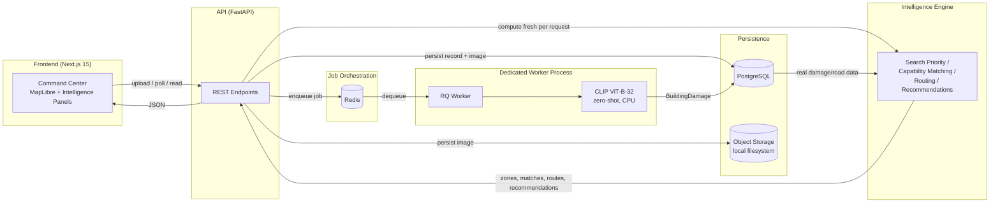

<div align="center">

# 🛰️ SentinelAI

### AI-Powered Disaster Intelligence & Response Platform

*Turning disaster imagery into prioritized response zones, capability-aware resource matching, route feasibility, and evidence-grounded operational recommendations.*

[](LICENSE)
[](docs/architecture/production.md)
[](CONTRIBUTING.md)
[](CODE_OF_CONDUCT.md)

[Overview](#overview) •
[Problem](#the-problem) •
[Architecture](#system-architecture) •
[Pipeline](#end-to-end-pipeline) •
[AI/ML](#aiml-approach) •
[Intelligence Engine](#intelligence-engine) •
[Running Locally](#running-locally) •
[Testing](#testing) •
[Limitations](#limitations)

</div>

---

## Overview

**SentinelAI** is an AI-powered disaster intelligence and response platform that transforms disaster imagery and infrastructure observations into prioritized response zones, capability-aware resource matching, route feasibility, and evidence-grounded operational recommendations.

Upload an aerial or satellite image of a disaster-affected area and SentinelAI runs it through an asynchronous inference pipeline (deterministic tile localization + zero-shot CLIP damage classification), persists the structured result, and feeds it into a rule-based intelligence engine that scores search priority, matches response capabilities against detected damage, evaluates route feasibility on a risk-aware road graph, and produces a traceable, evidence-linked recommendation — all rendered on a cinematic, MapLibre-based 3D command-center dashboard.

Every output in the real (non-demo) path is either **observed** (what the upload actually contains), **model-derived** (a real CLIP forward pass, honestly labeled as zero-shot, not a trained disaster-damage detector), or **calculated** (deterministic scoring/routing over that real data) — never fabricated. Where the system doesn't have enough evidence to answer a question — no georeference, no road network, no trained checkpoint — it says so explicitly instead of inventing an answer. This discipline is enforced throughout the codebase, not just in the UI copy: see [Honest System Boundaries](#honest-system-boundaries).

## The Problem

Disaster response is a race against time, and the imagery pipeline available to most response teams today is not built for speed:

- **Situational awareness is fragmented** — imagery, damage reports, and field updates typically live in disconnected tools, delaying the "single source of truth" a command center needs.
- **Damage assessment is still manual** — analysts visually triage imagery frame-by-frame, a process that does not scale to the volume produced by modern drones and satellites.
- **Routing tools ignore disaster context** — conventional navigation systems assume a road network is intact, a dangerous assumption immediately after a disaster.
- **Resource dispatch is not capability-aware** — "closest available unit" isn't the same question as "which unit can actually perform this task, is available, and can physically reach this location."
- **Recommendations are opaque** — a black-box priority score is much less actionable than one that shows exactly which evidence produced it.

SentinelAI addresses each of these with a single, cohesive, evidence-traceable pipeline rather than a patchwork of point solutions.

## System Architecture



**Design principles:**

1. **The API process never loads the ML model.** `POST /api/v1/analysis` validates, persists, stores the image, enqueues a job, and returns — a dedicated worker process is the only thing that ever imports `torch`/`open_clip`, loaded once at its own startup, not per-request.
2. **Intelligence is computed fresh, never cached/stale.** Search zones, capability matches, routes, and recommendations are pure functions of persisted damage/road data and current config — recomputed on every request rather than persisted, so they never drift from a config change.
3. **CRS safety is structural, not a UI convention.** Image-space coordinates and WGS84 geographic coordinates are distinct types throughout the backend; a value can never silently cross from one to the other. An un-georeferenced upload honestly reports `NO_GEOREFERENCE` rather than plotting invented coordinates.
4. **Real and Demo data never mix.** Every entity in the demo path carries `is_simulated: true`; every panel and map layer renders that flag explicitly. See [Demo Mode vs. Real Mode](#demo-mode-vs-real-mode).
5. **CPU-compatible by design.** No CUDA assumption anywhere in the stack — the model, the Docker images, and the worker all run on ordinary CPU hardware.

Full architecture documentation: [`docs/architecture/production.md`](docs/architecture/production.md) (backend/infra), [`docs/architecture/frontend.md`](docs/architecture/frontend.md) (frontend), [`docs/architecture/ai-engine.md`](docs/architecture/ai-engine.md) (AI/ML), [`apps/api/README.md`](apps/api/README.md) (the single most detailed reference — API endpoints, ML architecture, error taxonomy, and every milestone's own honesty disclosures).

## End-to-End Pipeline

```
Upload image
  → analysis record created & persisted (PostgreSQL)
  → image stored (object storage)
  → job enqueued (Redis / RQ)
  → API returns immediately (201, status="queued")
  → worker dequeues the job
  → deterministic tile localization (Stage 1)
  → CLIP ViT-B-32 zero-shot damage classification per tile (Stage 2, CPU)
  → BuildingDamage results persisted (PostgreSQL)
  → [on read] intelligence processing, computed fresh:
      → search-priority scoring (evidence-linked, uncertainty-disclosed)
      → capability matching (can the resource perform the task / is it available / can it reach the zone)
      → route feasibility (risk-aware Dijkstra/A* over the loaded road graph)
      → recommendation (traceable to the exact evidence and rule that produced it)
  → command-center dashboard (map + intelligence panels)
```

The API never blocks on inference — the worker owns the model and the request/response cycle is decoupled from it via the job queue. See [`docs/architecture/production.md`](docs/architecture/production.md), "Architecture" and "Queue / worker design."

## AI/ML Approach

**Stated plainly, because this is the part most portfolios get wrong to oversell: SentinelAI's damage classifier is not trained on disaster imagery.**

- **Stage 1 — Building localization**: deterministic image tiling (`TileRegionLocalizer`), not a learned detector. No off-the-shelf pretrained model has a "building" class suitable for this, so rather than bolt on an unsuitable one, this stage is honestly deterministic.
- **Stage 2 — Damage classification**: **zero-shot classification using a real, genuinely pretrained CLIP checkpoint** (`open_clip`, `ViT-B-32`/`openai`) — a general-purpose vision-language model, prompted against the four damage classes (`no_damage` / `minor` / `major` / `destroyed`). It has **never been fine-tuned on xBD or any disaster-damage dataset.**
- **No calibrated confidence.** CLIP's softmax output is reported as a real (not fabricated) number, but it is explicitly *not* claimed to be a calibrated probability of actual damage — see the confidence-interpretation disclosure in [`apps/api/README.md`](apps/api/README.md).
- **A legacy path exists** (`Settings.MODEL_PROVIDER="legacy_resnet"`) — an untrained ResNet18 baseline, preserved from an earlier milestone, useful only as an architectural placeholder.
- **An xBD training pipeline exists but has not been run.** The dataset-parsing/label-normalization code lives in `apps/api/app/ml/datasets/`; no dataset is downloaded or committed, and no training has happened on this (CPU-only) development machine. A trained, evaluated checkpoint is explicitly future work, not a current capability.
- **Runs entirely on CPU.** No CUDA/GPU assumption anywhere in the model-loading, inference, or Docker configuration.

Full rationale, prompt design, and known limitations: [`docs/architecture/ai-engine.md`](docs/architecture/ai-engine.md) and [`apps/api/README.md`](apps/api/README.md).

## Intelligence Engine

Given persisted, real `BuildingDamage` results (and, separately, a loaded road-network graph), the intelligence engine answers four questions, each independently inspectable and never collapsed into one opaque score:

1. **Where should responders look first?** — search-priority zones scored from real damage evidence, always labeled "priority search zone based on available evidence" — never a claim that a person is located there. Every score carries its contributing factors, missing factors, and an uncertainty disclosure (level, reason, missing information).
2. **What can reach it?** — capability matching against a resource pool: can the resource perform the task, is it available, is it reachable, is a route actually operational. Each of the four questions is a separate field, not one blended number.
3. **Is a route actually feasible?** — real Dijkstra/A* pathfinding over the loaded road graph, risk-graded per edge, distinguishing a computed route from "no road network is loaded" from "no path exists."
4. **What should be done?** — a closed, deterministic vocabulary of recommendations (e.g. `deploy_ground_search_team`, `avoid_route_due_to_hazard`), each traceable to the exact evidence and rule that produced it, with disclosed limitations.

Everything above is a pure, side-effect-free computation over real persisted data and current configuration — recomputed on every request, never cached into a second, potentially-stale source of truth.

## Geospatial / CRS Design

A structural rule enforced throughout the backend, not a convention: **image-space coordinates (pixel positions in the uploaded photo) and WGS84 geographic coordinates (real latitude/longitude) are distinct types that can never silently convert into each other.** Every geometry carries an explicit `coordinate_reference_system` tag (`IMAGE` or `EPSG:4326`). An upload with no georeferencing metadata produces damage results honestly tagged `IMAGE`-space, and any downstream feature that needs real geography (map plotting, routing, search-zone geolocation) reports an explicit `NO_GEOREFERENCE` unavailable-reason rather than inventing coordinates. The frontend enforces the identical rule independently — the map only ever plots a feature whose CRS tag is genuinely `EPSG:4326`.

## Production Architecture

Real PostgreSQL persistence, a Redis-backed job queue, and a dedicated worker process that owns the ML model — turning the local application into a deployable, production-*style* platform (not a claim of actual cloud deployment; see [Limitations](#limitations)).

- **PostgreSQL** — the analysis lifecycle record (status, timestamps, model metadata, failure detail) and one row per detected building, via a real repository layer (`PostgresAnalysisRepository`/`PostgresSpatialRepository`) implementing the same Protocol the in-memory test implementations already used — no parallel/duplicated persistence logic.
- **Redis + RQ** — the background job queue. `POST /api/v1/analysis` persists, stores the image, enqueues, and returns immediately; a separate worker process dequeues and runs the real inference pipeline. Jobs are idempotent (a terminal-state guard plus replace-semantics repositories mean duplicate delivery is a safe no-op) and retries are bounded (`JOB_MAX_RETRIES`), with deterministic failures (invalid image, no georeference, model unavailable) never retried.
- **Dedicated inference worker** — the only process in the whole stack that ever imports `torch`/`open_clip`. The API process uses a zero-cost placeholder model it never invokes for real inference, eliminating the in-request cold-start problem entirely.
- **Model lifecycle** — explicit states (`STARTING` / `MODEL_LOADING` / `READY` / `UNAVAILABLE` / `FAILED`) published by the worker over Redis and exposed via `GET /api/v1/model/status`.
- **Health vs. readiness** — `GET /health` (liveness — never touches Postgres/Redis/the model) is distinct from `GET /ready` (real database + queue connectivity; model status reported but non-gating, matching "a request can be accepted while the model is still loading").
- **Docker Compose** — `postgres`, `redis`, `migrate` (one-shot `alembic upgrade head`, gates `api`/`worker` startup), `api`, `worker` (same image, different command), `web`. CPU-only throughout; a persistent volume caches the CLIP checkpoint across worker restarts.

Full detail — migrations, transaction boundaries, structured logging, security hardening, and the complete "Known limitations" list — lives in [`docs/architecture/production.md`](docs/architecture/production.md).

## Frontend Command Center

A dark, glass, "operational instrument" aesthetic (Next.js 15 App Router, MapLibre GL JS) built entirely on real API data in Real Mode:

- **Real 3D terrain** — genuine elevation data (Mapzen's public Terrarium DEM tiles, free/keyless), not a decorative effect; toggleable to a flat 2D view. 3D building extrusion was deliberately **not** implemented — no verified source of real per-building height data exists for the basemap in use, and fabricating an assumed height would violate the same CRS-honesty rule applied one layer further out.
- **Cinematic camera** — a one-time, deliberate pitch/bearing entrance the first time real bounds appear for an incident, never repeated on top of the user's own manual camera adjustments, respecting `prefers-reduced-motion` throughout.
- **Priority-zone emphasis** — a shape-based (not color-only) selection ring synced between the map and the intelligence panel, plus a restrained pulse on the single top-priority zone.
- **Route visualization** — real computed route geometry progressively revealed (never interpolated/invented points), with distinct styling for risk-aware, distance-only baseline, and recommended routes.
- **Resource markers, provenance-honest** — Demo Mode plots a full simulated fixture; Real Mode can only ever honestly plot what the API actually returns (a capability-match candidate's real computed route start point), never a guessed location.
- **Map controls** — 3D/2D toggle, recenter, locate top zone, focus route, reset north — every control keyboard-accessible with real `aria-label`s.
- **Honest empty states everywhere** — hazard/infrastructure counts are disclosed as text ("N hazard(s) — not shown on the map, no geometry available") rather than plotted as fabricated pins.

Full design-system and accessibility documentation: [`docs/architecture/frontend.md`](docs/architecture/frontend.md).

## Demo Mode vs. Real Mode

| | Demo Mode | Real Mode |
|---|---|---|
| Data source | Hand-authored fixtures (`lib/demo/demo-data.ts`) | Live backend API responses |
| Damage/search-zones/routes | Deterministic, clearly synthetic | Computed from a real uploaded image |
| Provenance labeling | Every entity tagged `is_simulated: true`, visible in the UI | Real data tagged accordingly; resource candidates still disclosed as simulated (see below) |
| Switching | An explicit, always-visible toggle in the top bar | Default state |

**The two modes are never silently mixed.** One caveat disclosed everywhere it applies, not hidden: no live resource-ingestion system exists yet, so even in Real Mode, matched-resource *identities* come from a fixed simulated pool — only the *zone scoring, route computation, and damage data* they're matched against are real. The UI and API both label this explicitly (`resources_are_demo`), never silently presenting a simulated resource as a live one.

## Honest System Boundaries

Explicitly **not** claimed by this project, to avoid exactly the kind of overclaiming that erodes trust in a technical portfolio:

- ❌ A model trained or fine-tuned on xBD or any disaster-damage dataset (it's zero-shot CLIP — see [AI/ML Approach](#aiml-approach))
- ❌ Calibrated damage-probability confidence scores
- ❌ Real-time disaster/satellite data feeds
- ❌ Live emergency-resource integration (dispatch systems, real fleet tracking)
- ❌ Predictive hazard modeling
- ❌ Actual cloud deployment, autoscaling, or high availability (Docker Compose is a local production-*style* stack — see [`docs/architecture/production.md`](docs/architecture/production.md), "Known limitations")
- ❌ Authentication/authorization (deliberately out of scope so far)

## Running Locally

Prerequisites: Node.js ≥ 20, Python 3.12, and Docker (for the full stack) or PostgreSQL + Redis (for a manual setup).

### Docker Compose (recommended — the full production-style stack)

```bash
docker compose up --build
# API:     http://localhost:8000  (docs at /docs)
# Web:     http://localhost:3000
# health:  http://localhost:8000/health
# ready:   http://localhost:8000/ready
```

### Manual setup

```bash
# --- Backend ---
cd apps/api
python -m venv .venv
.venv/Scripts/activate              # macOS/Linux: source .venv/bin/activate
pip install -e ".[dev]"
cp .env.example .env                # set DATABASE_URL / REDIS_URL for your local Postgres/Redis
alembic upgrade head
uvicorn app.main:app --reload       # http://localhost:8000
python -m app.worker.main           # in a second terminal — the worker owns the model

# --- Frontend (in a third terminal, from the repo root) ---
npm install
cp apps/web/.env.example apps/web/.env.local
npm run dev --workspace=apps/web    # http://localhost:3000
```

With the default configuration (`MODEL_ENABLED=True`, `MODEL_PROVIDER=open_clip`), a real upload downloads the pretrained CLIP checkpoint on first use (network required once, then cached) and runs real CPU inference — see [Performance](#performance-measured) for actual measured timing. **Demo Mode** (the toggle in the top bar) shows the fully populated dashboard without needing a real upload or a loaded road network.

## Testing

```bash
# Backend (from apps/api, with .venv activated)
python -m ruff check .
python -m mypy app
python -m pytest -q                                    # fast suite (in-memory/SQLite, no live infra)
python -m pytest tests/test_ml_real_inference_integration.py -v   # real CLIP model, run explicitly

# Frontend (from the repo root)
npm run lint --workspace=apps/web
npm run typecheck --workspace=apps/web
npm run test --workspace=apps/web -- --run
npm run build --workspace=apps/web
```

**Actually run, this session** — backend: `ruff` clean, `mypy` clean (141 source files), **612 passed, 1 deselected** (the real-CLIP test, run separately). Frontend: lint clean, typecheck clean, **106–114 tests passed across 21–23 files** (exact count depends on which milestone's tests are included), production build succeeded. The backend test suite deliberately never requires a live CLIP download for its default run — the real-inference path has its own explicit, separately-run integration test instead.

## Performance (measured)

Only numbers actually measured in this repository's own test runs — nothing here is estimated or invented:

- **Real CLIP inference, end-to-end** (cold checkpoint download + load + one real forward pass + full HTTP round trip, `MODEL_TILE_GRID=1`): **96.44s**, measured directly by `test_ml_real_inference_integration.py`'s own `time.perf_counter()` wrapper.
- **Backend test suite** (612 tests, excluding the real-inference test): **~140–310s**, depending on concurrent host load at the time of the run.
- **Frontend test suite** (106–114 tests): **~300–340s** under `vitest`.
- **Frontend production build**: compiles in **~70–90s**.

**Not measured**: warm (cached-checkpoint) inference latency in isolation, queue latency against a real Redis instance under load, worker cold-start as an isolated metric, or Docker container startup time — these are honestly reported as not measured rather than estimated.

## Limitations

- **No trained, evaluated damage-detection model** — zero-shot CLIP, not xBD-trained; no accuracy/precision/recall/F1/IoU has been measured, because no ground-truth evaluation set has been run against it.
- **Not deployed anywhere** — a local, production-*style* Docker Compose stack, not a live cloud deployment; no autoscaling, no HA, no managed database, no TLS.
- **No authentication** — anyone who can reach the API can upload/read analyses.
- **No live resource-ingestion system** — matched-resource identities are always a simulated pool, even against real zone/route data (see [Demo Mode vs. Real Mode](#demo-mode-vs-real-mode)).
- **No hazard/infrastructure geometry** — counts are tracked but no endpoint returns their locations; the frontend discloses this honestly instead of fabricating map pins.
- **Object storage is local-filesystem only** — no S3/R2/GCS-backed implementation yet, though the interface is designed for one.
- **Single worker process** in the default Compose stack — RQ supports horizontal scaling natively, but it isn't configured/tested here.

The complete, itemized limitations list (with the specific reasoning behind each) lives in [`docs/architecture/production.md`](docs/architecture/production.md) and [`apps/api/README.md`](apps/api/README.md).

## Future Work

- A real, trained, and evaluated xBD checkpoint (the dataset pipeline already exists; training has not been run).
- Multi-modal damage assessment combining optical imagery with SAR for all-weather, day/night analysis.
- Change detection using pre-/post-disaster image pairs.
- S3-compatible object storage; a dead-letter/poison-queue view; multi-worker horizontal scaling, tested; authentication.
- True browser-based visual QA in CI (no headless-browser tooling is currently wired into this project's automated verification).

More detail: [`docs/research/future-work.md`](docs/research/future-work.md), [`docs/architecture/production.md`](docs/architecture/production.md) ("Recommended F6").

## Engineering Highlights

- **Asynchronous AI pipeline** decoupling upload from inference via a Redis/RQ job queue, so the API never blocks on a 40–150s model cold start.
- **Real PostgreSQL persistence** behind a repository-Protocol abstraction shared between production and in-memory test implementations — no parallel/duplicated schema.
- **A dedicated inference worker** with explicit model-lifecycle states, eliminating in-process model loading from the API entirely.
- **Structural CRS safety** — image-space and geographic coordinates are distinct types throughout the stack, enforced independently on both backend and frontend, never silently converted.
- **An evidence-traceable intelligence engine** — every priority score, capability match, and recommendation links back to the specific real data that produced it, with disclosed uncertainty rather than a false sense of precision.
- **A cinematic, real-3D-terrain MapLibre command center** that never fabricates geography — building extrusion was investigated and deliberately not implemented once no legitimate height-data source could be verified.
- **CPU-compatible deployment throughout** — no CUDA assumption in the model, the Docker images, or the worker.
- **A sustained project-wide discipline against fabrication** — provenance labeling, honest empty/unavailable states, and non-invented performance numbers, enforced as consistently in the codebase and its own documentation as in this README.

## Contributing

Contributions are welcome. Please read [`CONTRIBUTING.md`](CONTRIBUTING.md) for branching strategy, commit conventions, coding standards, and the pull request workflow before opening a PR. All participants are expected to follow the [Code of Conduct](CODE_OF_CONDUCT.md).

## License

SentinelAI is released under the [MIT License](LICENSE).
